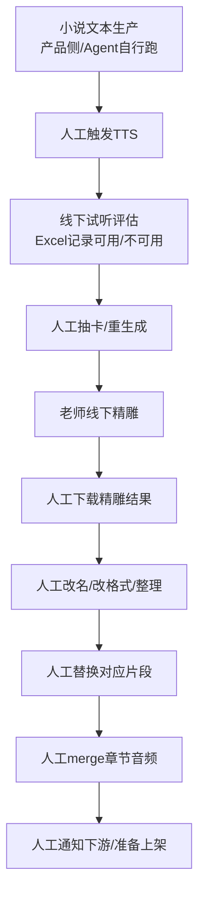
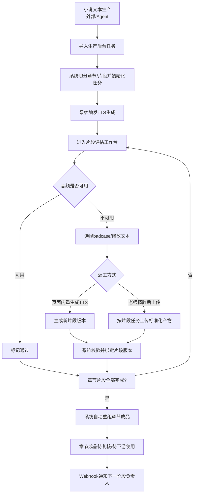

# 一期-任务流转+TTS

<!--
status: active
date: 2026-03-28
tags: [audiobook, tts, workflow, phase1]
-->

|  **修改人**  |  **日期**  |  **修改内容**  |  **版本**  |
| --- | --- | --- | --- |
|  齐郅   |  2026.03.24  |  初稿  |  第一版  |
|  齐郅   |  2026.03.26  |  一期实现范围修改  |  第二版  |

# 背景

当前有声书生产流程整体为：小说文本生产 -> 转 TTS -> 精雕 -> 上架。当前核心问题不是单点能力不足，而是跨阶段协作依赖线下流转，导致以下问题持续存在：

1.  转 TTS 后的评估、抽卡、精雕、替换回填依赖 Excel 与人工通知，效率低且容易漏标、错标。
    
2.  精雕结果回传后，仍需人工下载、整理成统一格式、再人工替换和合并，造成明显的人力瓶颈。
    
3.  各阶段负责人分散，状态流转缺乏统一任务中枢，依赖钉钉沟通，过程不可追踪、不可审计。
    
4.  缺乏片段级版本管理，无法清晰知道某个章节当前生效的是哪一版音频，也不利于后续质检与回滚。
    

结合当前业务实际，一期不追求把所有生产能力全部自动化，而是先将“任务流转 + TTS 生成 + 片段评估返工 + 精雕结果标准化回填 + 章节自动重组”打成一个最小闭环，使系统具备直接产出章节级标准成品音频的能力。

一期预期收益如下：

*   线下 Excel 标注迁移到线上，减少漏填、错填、丢状态问题。
    
*   将人工 merge 问题前置为“标准化上传 + 系统自动回填”问题，显著降低人力消耗。
    
*   建立任务、状态、负责人、操作日志、版本的统一管理模型，为二期进一步接入自动质检、精雕 API 和上架闭环提供底座。
    
*   单人力迭代下即可形成可演示、可试运行、可扩展的生产后台 MVP。
    

# 流程

## 旧流程

旧流程主要问题：

*   评估与返工信息结构化程度低，无法强约束。
    
*   精雕结果和原片段之间缺少稳定映射关系。
    
*   merge 依赖人工文件处理，而不是系统内版本替换。
    
*   各阶段负责人通过沟通协调推进，状态不透明。
    

## 新流程（一期）

新流程中，一期将“人工 merge”降级为系统内部的“章节自动重组”。系统只认片段任务及其版本，不再以人工整理文件作为关键步骤。

# 方案设计

一期的范围已经包含原一、二、四期，因此方案设计重点不是拆功能，而是确定整体落地模式。核心需拍板的点有三个：

1.  TTS 与评估是否集成在同一后台；
    
2.  精雕结果回填是采用文件包导入还是任务式上传；
    
3.  章节成品生成是显式 merge 页面还是系统自动重组。
    

## 3.1 方案一：一体化生产后台（推荐）

### 设计说明

采用统一生产后台承接整条一期链路，覆盖以下模块：

*   任务导入与初始化
    
*   token 进入首页并识别操作者
    
*   章节/片段任务列表
    
*   TTS 批量生成
    
*   片段评估工作台
    
*   badcase 标注、文本修订、备注
    
*   页面内重生成 TTS
    
*   老师按片段任务上传精雕结果
    
*   片段版本管理
    
*   章节自动重组
    
*   webhook 通知与操作日志
    

### 关键业务对象

#### 1）任务对象

*   book\_id
    
*   chapter\_id
    
*   segment\_id
    
*   stage（tts / review / polish\_upload / chapter\_rebuild）
    
*   owner
    
*   status
    

#### 2）片段版本对象

*   segment\_id
    
*   version\_no
    
*   source\_type（tts\_init / tts\_regen / polish\_upload）
    
*   audio\_url
    
*   text\_content
    
*   format\_meta（采样率、编码、声道、时长等）
    
*   is\_active
    

#### 3）操作日志对象

*   operator\_token
    
*   operator\_role
    
*   action
    
*   target\_id
    
*   before\_status
    
*   after\_status
    
*   timestamp
    

### 评估工作台设计要点

结合现有评估需求，一期工作台保留如下能力：

*   进入任务后自动加载当前片段原始文本和初始音频。
    
*   标注员先判定“可用/不可用”。
    
*   若可用，直接提交，状态流转为通过。
    
*   若不可用，展开扩展表单，填写 badcase、修改文本、备注，并选择：
    
    *   页面内一键 TTS 重生成；
        
    *   老师线下精雕后按片段任务上传。
        
*   修改后文本默认带入原始文本。
    
*   上传的新音频在页面内支持试听复核。
    
*   只有“不可用”时，badcase 和新音频为必填。
    

上述能力与现有评估需求文档一致，尤其强调了“可用/不可用分支”、“条件联动表单”、“文件上传或页面内 TTS 二选一”的交互设计。

### 精雕回填设计要点

一期不强制精雕服务 API 接入，优先采用“老师按片段任务上传”的模式，但必须满足：

*   上传动作发生在具体 segment 任务下，而不是独立上传文件包。
    
*   系统校验格式要求（编码、采样率、声道、文件大小）。
    
*   上传成功后自动生成新的片段版本，并标记为当前生效版本。
    
*   一个片段允许保留多个版本，支持回滚和审计。
    
*   后续章节成品始终以片段当前生效版本参与自动重组。
    

### 章节自动重组设计要点

不再设计重量级 merge 页面，而是采用系统自动重组：

*   章节内所有片段达到“可用/已上传生效版本”后，系统自动生成章节成品。
    
*   系统按 segment 顺序读取 active version 并拼接。
    
*   若某片段版本缺失或格式校验失败，则章节重组失败并打回待处理。
    
*   重组结果挂回章节维度，供下游复核或进入后续环节。
    

### 优点

*   业务闭环完整，一期结束即可显著降低线下沟通和人工 merge 成本。
    
*   任务式上传天然绑定片段，降低错传和回填错误。
    
*   数据模型统一，为二期接自动质检、精雕 API 和上架闭环提供稳定基础。
    
*   用户心智更统一，不需要多个系统来回跳转。
    

### 缺点

*   一期范围较大，对数据建模和状态机设计要求高。
    
*   前后端都需要一定投入，不能只做单页工具。
    
*   章节自动重组虽然不复杂，但需要在格式约束上一次设计清楚。
    

## 3.2 方案二：半集成后台 + 外部工具协同

### 设计说明

后台仅承接任务流转、TTS 触发、评估记录与通知；老师精雕仍在线下完成，系统只提供一个“文件包上传入口”，由后台解析命名规则后批量替换片段，再统一触发章节 merge。

### 关键形态

*   任务页中可查看片段和评估结果
    
*   精雕结果不按任务上传，而是将文件包统一上传
    
*   系统依赖命名规则识别对应 segment
    
*   merge 以按钮形式显式触发
    

### 优点

*   前端交互实现更轻，初期开发速度可能更快。
    
*   对老师操作习惯改造较小，容易短期接入。
    

### 缺点

*   文件包导入强依赖命名规范，出错概率高。
    
*   系统仍然缺少强绑定关系，容易发生错片段替换。
    
*   merge 仍然显式存在，说明人工文件处理逻辑没有真正被消掉。
    
*   长期上不利于接自动质检与精雕 API，因为回填模型仍然偏文件系统思维。
    

## 3.x 整体方案总结

一期推荐采用方案一，即“一体化生产后台”。

结论如下：

1.  一期目标不是做一个评估页面，而是做一个章节级生产闭环。
    
2.  merge 的痛点本质不是拼接算法，而是人工下载、整理、替换，因此应通过“任务式上传 + 版本替换 + 系统自动重组”消解。
    
3.  精雕 API 一期可以不接，但上传动作必须任务化、结构化，不能只依赖文件命名。
    
4.  TTS 生成、评估返工、精雕回填、章节重组应统一在同一后台内完成。
    

# 上线流程

## 涉及上下游

上游：

*   小说文本生产 Agent / 产品侧文本来源
    

当前期内上下游：

*   TTS 服务
    
*   老师精雕处理流程（线下）
    
*   钉钉 webhook / 通知系统
    

下游：

*   二期自动质检/精雕服务接入
    
*   上架或后续运营流程
    

## 上线步骤

### Step 1：数据模型与状态机上线

*   新建 book/chapter/segment/task/version/log 等表
    
*   只在测试环境接入，验证状态流转和版本管理
    

### Step 2：任务导入 + TTS 生成灰度

*   先导入少量章节任务
    
*   验证 TTS 批量生成与片段初始化
    
*   不影响现有线下流程，允许双轨运行
    

### Step 3：评估工作台灰度

*   选取少量标注人员使用线上评估页
    
*   与现有 Excel 并行一小段时间，核对结果一致性
    

### Step 4：老师上传精雕结果灰度

*   先在一个固定项目内试运行“按片段任务上传”
    
*   验证格式校验、版本替换、自动重组正确性
    

### Step 5：章节自动重组上线

*   对试点章节启用自动重组
    
*   对比人工成品与系统成品的一致性
    
*   验证通知、日志和失败回滚机制
    

### Step 6：切换为线上主流程

*   停止新项目使用 Excel 标注
    
*   后台成为默认流转平台
    
*   线下 Excel 仅保留历史应急兜底
    

## 平稳上线与止损策略

*   全程采用项目级灰度，不全量切换。
    
*   评估页上线初期允许双轨：线上操作 + 线下结果核对。
    
*   章节自动重组失败时，不阻塞原有人工流程，可回退到人工导出与拼接。
    
*   token 机制若发生权限混乱，可临时收紧到白名单项目。
    
*   若 TTS 接口或上传校验不稳定，可先关闭页面内重生成，仅保留上传模式。
    

# 风险

1.  一期范围相对较大，若需求不断扩张，容易出现 MVP 虚胖问题。
    
2.  若精雕上传规范未定义清楚，自动重组将无法稳定运行。
    
3.  页面内 TTS 重生成若涉及抽卡逻辑和多版本试听，前端实现复杂度会高于普通上传。
    
4.  当前仅采用 token 轻鉴权，存在长期权限体系不足的问题，但一期可接受。
    
5.  一期不处理正式上架闭环、运营统计、质检体系全量接入，这些将放到二期处理。